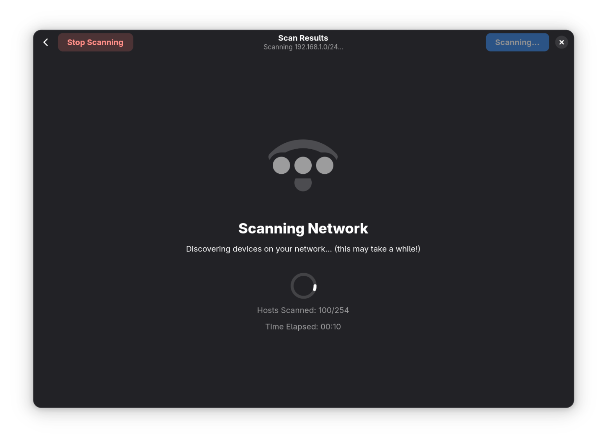
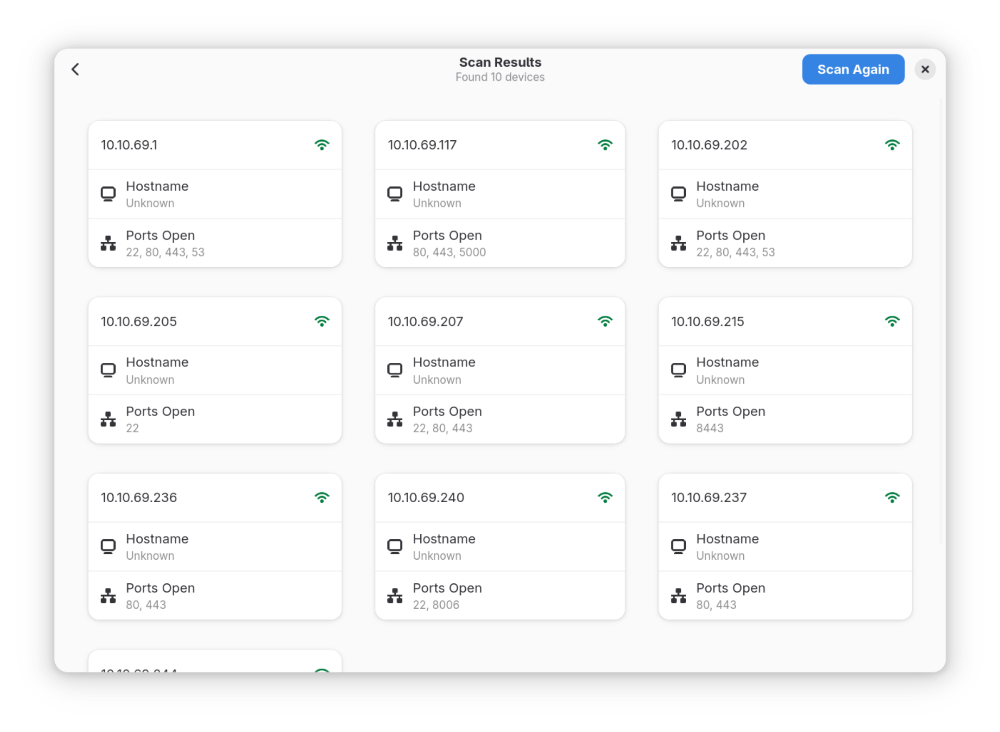

# 🔎 NetPeek

A modern network scanner for GNOME that helps you discover devices on your local network.

## 📷 Screenshots






<a href='https://flathub.org/apps/io.github.zingytomato.netpeek'>
    
</a>


## ⭐ Features

- 🔍 **Fast Network Scanning** - Discover active devices on your network
- 🏠 **Smart Auto-Detection** - Automatically detects your network range
- 🎯 **Port Scanning** - Shows open ports on discovered devices
- 📱 **Modern UI** - Built with GTK4 and Libadwaita
- ⚡ **Multi-threaded** - Fast concurrent scanning
- 🔧 **Flexible Input** - Supports CIDR notation, IP ranges, and single IPs

## 🔨 Installation

### Manual Build

```bash
git clone https://github.com/zingytomato/netpeek.git
cd netpeek
meson setup build
meson compile -C build
meson install -C build
```

### GNOME Builder

1. Clone the repository
2. Open the project folder in GNOME Builder
3. Click the "Run Project" button

### Supported Formats

- **CIDR**: `192.168.1.0/24`, `10.0.0.0/16`
- **Range**: `192.168.1.1-254`, `10.0.0.1-50`
- **Single IP**: `192.168.1.1`

## 👨🏻‍💻 Development

### Python Dependencies

All dependencies are included in the Python standard library:
- `socket` - Network operations
- `ipaddress` - IP address validation
- `threading` - Concurrent scanning
- `subprocess` - Network detection

## 📙 License

This project is licensed under the GPL-3.0 License - see the [LICENSE](LICENSE) file for details.

## ❓ Support

If you encounter any issues or have feature requests, please [open an issue](https://github.com/zingytomato/netpeek/issues).
